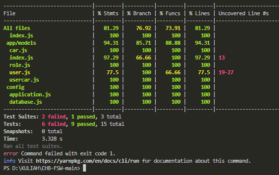

# BCR API

# Install
1. Download/Clone repository 
        https://github.com/tantrifadh/FSW3-Ch8
2. Instal Depenciens
3. Instal yarn add --dev jest
4. Jalankan yarn test

#Link deploy :
  fsw3-ch8-production.up.railway.app
  
#Hasil coverage :
  
